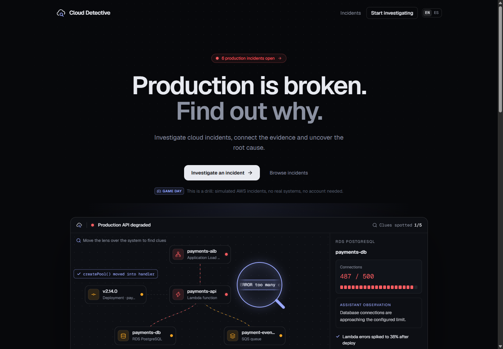
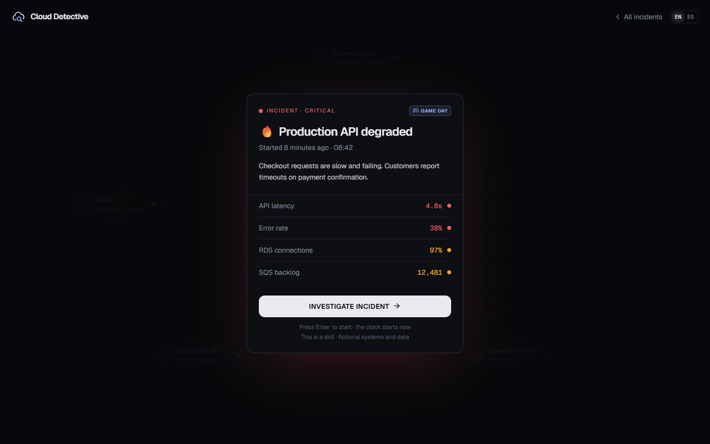
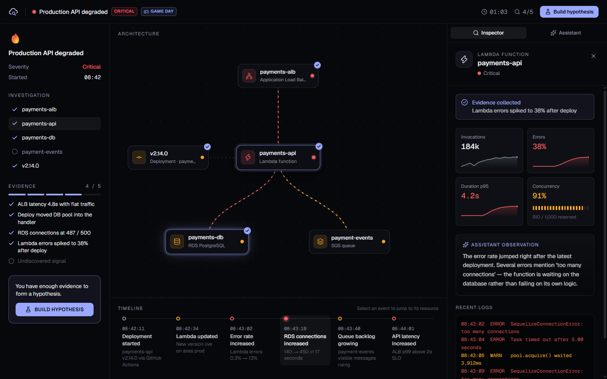
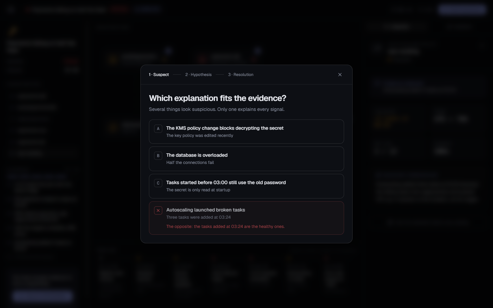
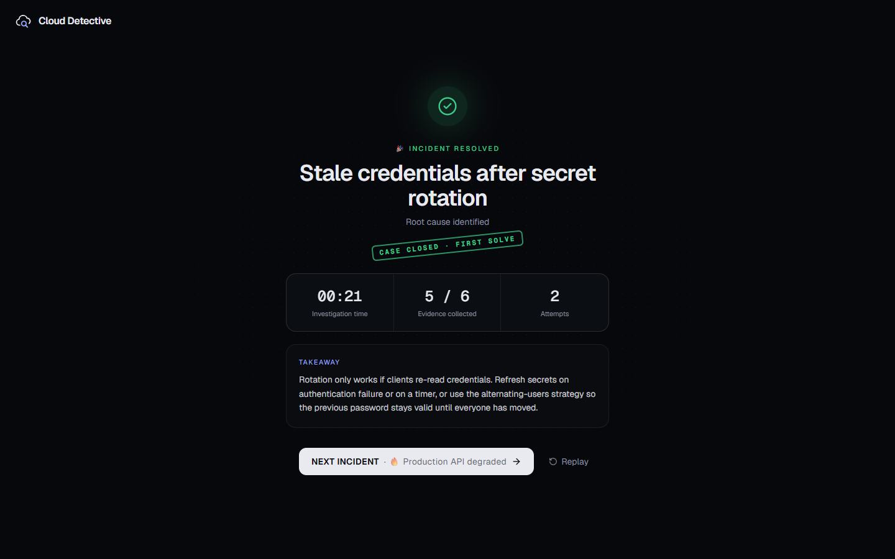
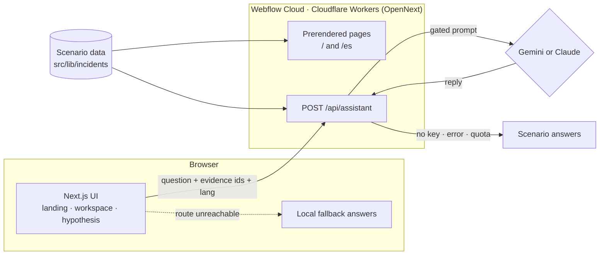

# ☁️🔎 Cloud Detective

**Production is broken. Find out why.**

Cloud Detective turns cloud incident response into a detective game. You get a simulated AWS production incident, explore an interactive architecture, read metrics, logs and the timeline, collect evidence and pick the fix that removes the root cause — not the symptom.

**[▶ Play it live](https://webflow-59002a.webflow.io)** · **[Versión en español](https://webflow-59002a.webflow.io/es)** · Built for the Nerdearla App Showcase on Webflow Cloud



> **This is a drill.** Every system, metric and log is fictional. No AWS account, no real infrastructure and no API key are needed to play.

---

## How to play

| | |
| --- | --- |
|  | **1. Get paged.** An incident brief shows the blast radius: error rate, latency, the one metric that looks off. The clock starts when you click *Investigate*. |
|  | **2. Investigate.** Click resources on the architecture to open their metrics, logs, diffs or CloudTrail events. Pick timeline events to jump to the resource involved. Each finding lands in your evidence list. Ask the assistant when you're stuck. |
|  | **3. Name the culprit.** Once you have enough evidence you can build a hypothesis. In harder cases you first pick the root cause among four believable suspects. Wrong picks explain why they don't fit. |
|  | **4. Fix it.** Choose the remediation that addresses the cause. You get your time, evidence and attempts, a takeaway, and a *solved* stamp with your best time on the case file. |

On the landing page, move the detective lens over the preview diagram: clues only reveal once you've scanned them completely.

## The cases

| | Case | What's really going on | Difficulty |
| --- | --- | --- | --- |
| 🔥 | Production API degraded | A deploy moved the DB pool into the Lambda handler; RDS runs out of connections | Rookie |
| 📦 | SQS processing delay | Workers crash on a new payload version; poison messages retry forever | Detective |
| 🔐 | Deployment failure | A GitHub environment changed the OIDC `sub` claim; the IAM trust policy rejects it | Inspector |
| 🌐 | Intermittent checkout errors | After a region migration, weighted DNS still sends 20% of traffic to an empty load balancer | Inspector |
| 🚦 | Orders API throttled | A new nightly batch eats the account-wide Lambda concurrency | Inspector |
| 🗝️ | Payments failing on half the fleet | Secrets Manager rotated the DB password; tasks started earlier still use the old one | Chief |

The last three add red herrings that look guilty (a deploy two minutes before the errors, CPU at 78%, a recent KMS policy change) and require the suspect step before the root cause is revealed.

## Features

- **Interactive architecture** with animated traffic, per-resource metrics, sparklines, capacity bars, logs and config diffs.
- **Evidence system** — inspecting a resource records what it proves; the hypothesis unlocks at a per-case threshold.
- **Investigation assistant** powered by Gemini or Claude that explains signals and suggests where to look, but won't hand you the answer.
- **Works without AI** — if there's no key, the provider fails or the free quota runs out, answers come from the scenario data. No error is ever shown.
- **Case files** with difficulty, *unsolved/solved* stamps and personal best times stored in your browser.
- **English and Spanish**, both prerendered: `/` and `/es`.
- **Responsive**: three columns on desktop, a slide-over inspector on laptops and tablets, and a phone layout that doesn't break.

## How it works



**The game is deterministic.** Evidence, the hypothesis threshold, the correct suspect and the correct fix all live in the scenario files. The LLM never decides whether you solved a case.

**The assistant can't spoil what it doesn't know.** The server builds the prompt from the scenario and only includes what the player has earned:

| Player progress | What the prompt contains | What the assistant may do |
| --- | --- | --- |
| Below the evidence threshold | Summary, timeline, metrics; logs and details only for inspected resources; **no root cause** | Explain signals, suggest the next resource |
| Threshold reached (standard cases) | Everything above **plus the root cause** | Confirm the root cause, never pick the fix |
| Threshold reached (suspect cases) | Still **no root cause** | Point at what to compare, ask a guiding question |

Requests are validated server-side: unknown incident, evidence or resource ids are dropped, questions are capped at 500 characters and history at six turns.

## Project structure

```
src/
├─ app/
│  ├─ page.tsx, incidents/, incident/[id]/   English routes
│  ├─ es/                                    Spanish routes (same pages, lang="es")
│  └─ api/assistant/route.ts                 assistant endpoint
├─ components/
│  ├─ pages/                                 landing and incident list, shared by both languages
│  ├─ Workspace.tsx                          investigation screen and its state
│  ├─ ArchitectureDiagram.tsx                interactive diagram
│  ├─ HypothesisDialog.tsx                   suspect → hypothesis → fix
│  └─ LandingPreview.tsx                     detective lens
└─ lib/
   ├─ incidents/                             scenarios (English) + es/ translation overlays
   ├─ assistant.ts                           prompt builder and deterministic fallback
   ├─ llm.ts                                 Gemini and Claude providers
   ├─ i18n.ts                                UI dictionary
   ├─ localize.ts                            merges translation overlays
   └─ progress.ts                            per-browser solved record
```

## Adding a case

1. Create `src/lib/incidents/my-case.ts` exporting an `Incident` (see `src/lib/types.ts`). A case declares:
   - `resources` with diagram positions (`x`, `y` in percent), metrics, optional `details` (logs, diffs) and the `evidence` id each one reveals;
   - `edges`, `timeline`, `rootCause`, `options` (exactly one `correct`) and, for harder cases, `suspects`;
   - `minEvidence` and the `fallback` answers used when there's no AI.
2. Add its Spanish overlay in `src/lib/incidents/es/my-case.ts`. It only lists translated text; arrays follow the English order and include `id`s so they stay aligned.
3. Register both in `src/lib/incidents/index.ts`. Both languages are prerendered automatically.

UI strings live in `src/lib/i18n.ts`; the `Messages` type makes a missing Spanish key a compile error.

## Run it locally

```bash
npm install
npm run dev        # http://localhost:3000  (Spanish at /es)
npm run lint
npm run build
```

Everything works without configuration. To enable the AI assistant, copy `.env.example` to `.env.local` and set one key:

| Variable | Purpose |
| --- | --- |
| `GEMINI_API_KEY` | Google Gemini key (the free tier works) |
| `GEMINI_MODEL` | Optional, defaults to `gemini-3.5-flash-lite` |
| `ANTHROPIC_API_KEY` | Anthropic Claude key |
| `CLOUD_DETECTIVE_MODEL` | Optional, defaults to `claude-opus-5` |
| `AI_PROVIDER` | Optional: `gemini` or `anthropic` when both keys are set (Anthropic wins otherwise) |

## Deploy to Webflow Cloud

1. Install the CLI globally, not as a project dependency: `npm i -g @webflow/webflow-cli`. On Windows a local copy locks its own files and breaks the `npm ci` step of the deploy.
2. Stop `npm run dev` (it also locks native modules in `node_modules`).
3. Run `webflow auth login` **outside this folder** (e.g. from your home directory). It writes `WEBFLOW_API_TOKEN` to a `.env` in the current directory, and OpenNext bundles any `.env` into the deployed worker. Make sure there is no `.env` here before deploying; the CLI reads its credentials from `%APPDATA%\webflow\auth.json`.
4. `webflow apps deploy`.
5. Optional: add `GEMINI_API_KEY` or `ANTHROPIC_API_KEY` as a **secret** environment variable in the Webflow Cloud environment.

Notes for this stack:

- Webflow Cloud sets `basePath` / `assetPrefix` from the mount path, so they are not in `next.config.ts`; client code reads `NEXT_PUBLIC_BASE_PATH` for `fetch`.
- The API route uses the Node.js runtime. The OpenNext Cloudflare adapter does not support `runtime = "edge"`.
- `/api/assistant` is public and unauthenticated. Use a dedicated key with a spend limit, or a free-tier key, which simply falls back to demo mode when its quota runs out.

## Built with

Next.js 16 · React 19 · TypeScript · Tailwind CSS 4 · Motion · Lucide · Gemini / Claude · Webflow Cloud (OpenNext on Cloudflare Workers)
